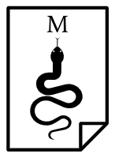

  

#  Mood Tracker

A mood tracker is a tool that is used to keep a record of a person's mood at regular intervals.
This application was created with main goal of helping people understand their emotions better.
It provides a record of the moods registered by the user and visualizations based on the data stored.

## Areas involved

- API
- Data storage
- Data parsing
- Data visualization

## Steps to run this project

In order to be able to see the output of this project, it is required to follow the next steps:

1. Clone the project
2. Install the requirements.txt